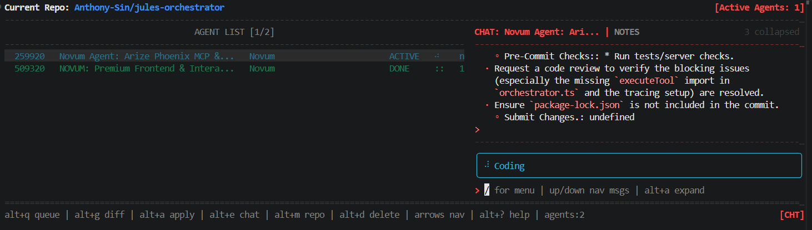
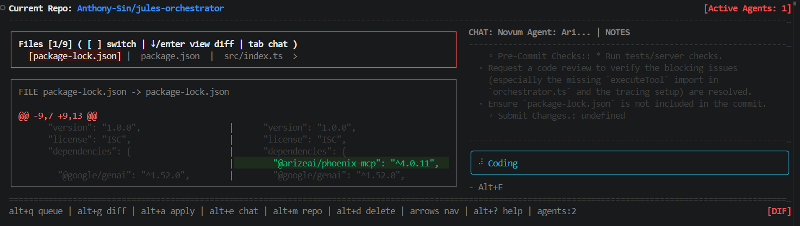

# Terjules

Terjules is a powerful Terminal User Interface (TUI) designed to manage, coordinate, and interact with multiple AI agents directly from your command line. Built with Node.js and the Ink library, it provides a seamless workspace for multi-agent workflows, code diffing, and repository management.


## Features

* **Multi-Agent Chat Interface (`Alt+E`):** Talk to different agents simultaneously. Easily navigate through conversations, queue up tasks, and review agent reasoning.

  

* **Integrated Diff Viewer (`Alt+G`):** Review code changes proposed by agents with an intuitive, color-coded terminal diff view before applying them to your repo.

  

* **Agent Task Queue (`Alt+Q`):** Monitor what your agents are currently working on, their statuses (WAIT, DONE), and read their execution notes.

* **Repository Navigator (`Alt+M`):** Quickly view and manage your active project repository.

* **Markdown Support:** Renders bolding, lists, and code blocks cleanly in your terminal.

## Installation & Setup

**Prerequisites:**

* [Node.js](https://nodejs.org/) (v22+ recommended)

* npm

1. **Clone the repository:**

   ```bash
   git clone <your-repo-url>/terjules.git
   cd terjules
   ```

2. **Install dependencies:**

   ```bash
   npm install
   ```

3. **Configure Environment:**
   Open the `.env` file in the root directory and ensure your API keys and environment variables are set up according to your required agent providers (e.g., Anthropic, OpenAI, Gemini).

## Usage

To launch the orchestrator, run:

```bash
node bin/jorch.js
```

*(Or if you have a start script in your `package.json`, you can run `npm start`)*

## Keyboard Shortcuts

Terjules is entirely keyboard-driven. Here are the global keybindings:

### Views & Navigation

* **`Alt + E`** : Open Chat Panel

* **`Alt + Q`** : Open Agent Queue / List

* **`Alt + G`** : Open Diff Viewer

* **`Alt + M`** : View Repository Workspace

* **`Alt + ?`** : Help Menu

### Actions

* **`Alt + A`** : Apply Code / Diff

* **`Alt + D`** : Delete current item / clear

* **`Alt + X`** : Expand long chat messages / View hidden lines

* **`Up / Down Arrows`** : Navigate messages, menus, and diff lines

* **`/`** : Open context menus inside the chat input

## Project Structure

* `/bin` - Executable entry point (`jorch.js`).

* `/config` - Default configuration and environment setup.

* `/inbox` - Markdown files acting as state/memory buffers for specific agents (e.g., Executive, Conflict, UI).

* `/src/tui` - Frontend UI components built with Ink/React (Chat, Diff, Layout, Tables).

* `/src/state` - Global state management and API integration for the agents.

* `/tests` - Test suites for the CLI, State, and UI components.

* `/pics` - Screenshots and image assets for documentation.

**Maintained by:** Anthony-Sin
